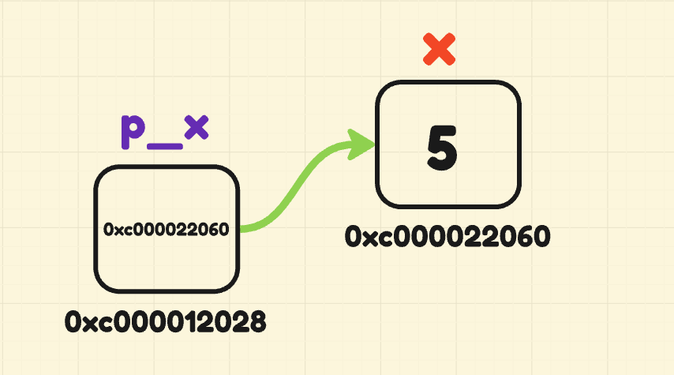

# Talking About Familiar Concepts

> Now, we'll talk about essential concepts for both this project and for **Go** itself!

For those who have studied a bit of the **C language**, they will understand the ideas more easily. But I'll try to explore each of these concepts sufficiently.

## Going Deeper

So, finally let's talk about the `struct` type and **_Go Way_** paradigm!

Basically, the definition of structs requires this format:

```go
package main

type NewStruct struct {
    // some definitions
}
```

Well, but to be more specific. Let's create an example that will be useful for the rest of this topic:

```go
package main

// using the package I had said before, remember?
import "fmt"

type Car struct {
    Brand string
    Model string
    year int
    motorState bool
}

// ...
```

> I know, I know... Some properties have the first letter capitalized, while others don't. But it's not just an aesthetic detail, **it's also a consequence of visibility**.

The above `struct` declaration is a classic example. Basically, the `struct` **Car** is a _blueprint_ for variable of this type.

For those who come from the **Clang**, this concept is already understood. But for those accustomed to the _OO paradigm_, understand that the `struct` "equates" to the `class` and the variable as the object, with this variable **_"being an instance of the `struct`"_**.

Note:

```go
// ...

func main() {
    car := Car{
        Brand: "Pagani",
        Model: "Zonda R",
        year: 2007,
        motorState: false,
    }

    fmt.Println(car)
    // will show `{Pagani Zonda R 2007 false}`
}
```

> This syntax reminds me a lot of the **C#** feature ([Object and Collection Initializers](https://learn.microsoft.com/en-us/dotnet/csharp/programming-guide/classes-and-structs/object-and-collection-initializers)) which is literally the same way!

Sure, there's already quite a bit you can do. But there's something even more interesting that **Golang** provides: _methods_!

Methods in **Go** are functions specified for a `struct` type, which follow the following notation (exactly like the functions that have already been seen):

```go
func (car Car) Run() {
    fmt.Printf("%s %s is running...\n", car.Brand, car.Model)
}
```

So, the function (actually, _method of the Car `struct`_) will only be visible to instances of Car!

```go
// ...
func main() {
    car := Car{
        Brand: "Pagani",
        Model: "Zonda R",
        year: 2007,
        motorState: false,
    }
    car.Run() // will show `Pagani Zonda R is running...`
}
```

That's why this code:

```go
// ...
func main() {
    Run()
}
```

It will throw a compile-time error:

```bash
# command-line-arguments
...: undefined: Run
```

Actually, quite interesting! But there's a problem here... If we declare a _method_ like this:

```go
func (car Car) ToggleMotorState() {
    car.motorState = !car.motorState

    if (car.motorState) {
        fmt.Println("The car engine is on.")
        return
    }
    fmt.Println("The car engine is off.")
}
```

If we try to run this method with an instance of the Car `struct`, we will get the following result:

```go
// ...

func main() {
    car := Car{
        Brand: "Pagani",
        Model: "Zonda R",
        year: 2007,
        motorState: false,
    }
    car.ToggleMotorState()
    car.ToggleMotorState()
    car.ToggleMotorState()
}
```

```bash
The car engine is on.
The car engine is on.
The car engine is on.
```

But why?

Simply put, this method won't do what's needed (toggle the value of the `motorState` property) **because it's using pass-by-value instead of pass-by-reference**!

For those who come from OOP and if our `struct` were actually a `class`, this method would work. Both for those in OO and for **Clang** programmers (who already have a deeper understanding), **_they know what memory reference means_**.

Let's talk about it:

### Value Passing vs. Reference Passing

Let's illustrate with the following function:

```go
func increment(target, value int) {
    target += value
    fmt.Println(target)
}
```

The _passage by value_ occurs when, within the function scope, the parameter is local (thus, **the argument will be copied into the function scope**). So, if there is no return, **the argument won't be changed and the function won't have any effect**.

```go
// ...

func main() {
    var x int = 5

    increment(x, 5) // it will show `10`
    fmt.Println(x) // but it's still `5`
}
```

So, how to solve it? Simple, with _pass-by-reference_. Now, the topic gets more interesting.

First, let's fix the previous function to correct this inconsistency:

```go
func increment(target *int, value int) {
    *target += value
    fmt.Println(*target)
}
```

And in the `main` function, just a few subtle changes:

```go
// ...

func main() {
    var x int = 5

    increment(&x, 5) // it will show `10`
    // what does `&` mean?
    fmt.Println(x) // now, it will also show `10`
}
```

Great, the _pass-by-reference_ worked! Anyone who has programmed in **Clang** knows where it leads us!

Pass-by-reference works differently; if specified in the parameter (as in the case of the `increment` function, using `*` character), **a copy of the argument won't be created, but instead it will operate on the memory space of the argument itself**.

Sure! Let's talk about **pointers**!

### About Pointers

To remember, let's review the central concept in **Golang** that was inherited from **C language** (even in terms of syntax): **_pointers_**!

By definition, _pointers_ are special variables that store the memory address of another variable same type. Unlike a regular variable, which is limited to the value it stores, pointers manipulate where the value is stored (accessed through a _memory address_), allowing the `increment` function to work!

Two characters are used for this _memory reference_ purpose: `*`and `&`.

> `*` := **represents both the declaration of a pointer and _the dereference operation_** ¹;
>
> `&` := **accesses the memory address of the variable it accompanies, _it is the expected value for a pointer_**;

¹ It's called _dereferencing_ when, from the pointer, we access the value of the variable it refers to.

```go
package main

func main() {
    x := 5
    p_x := &x

    fmt.Println(x, *p_x) // only the stored values
    fmt.Println(&x, p_x) // the memory address of `x`
    fmt.Println(&p_x) // the memory address of `p_x`
}
```

The result is variable, but one possible outcome would be:

```bash
5 5
0xc000022060 0xc000022060
0xc000012028
```

> Memory addresses are formatted in _hexadecimal base_!

<p align="center">

</p>

The drawing is bad, but I hope the explanation was clear enough!

### Reference Methods

Do you still remember the `ToggleMotorState` method and its pass-by-value? Let's fix that with what we've learned!

`ToggleMotorState` method would look like this:

```go
func (car *Car) ToggleMotorState() {
    car.motorState = !car.motorState

    if (car.motorState) {
        fmt.Println("The car engine is on.")
        return
    }
    fmt.Println("The car engine is off.")
}
```

Now, with just a new character (`*` in the method declaration), our method works as expected:

```go
// ...

func main() {
    car := &Car{
        Brand: "Pagani",
        Model: "Zonda R",
        year: 2007,
        motorState: false,
    }
    car.ToggleMotorState()
    car.ToggleMotorState()
    car.ToggleMotorState()
}
```

```bash
The car engine is on.
The car engine is off.
The car engine is on.
```

> The only difference is that instead of instantiating a `struct` Car, the method needs a _pointer_ to that type of `struct`. That's why the initialization statement includes the character `&`.

One interesting detail is that **function declarations that use memory references allows us to create _constructors_ for our types**!

For example, the `struct` Car would have the following _constructor_:

```go
// ...

func NewCar(brand, model string, year int, motorState bool) *Car {
    return &Car{
        Brand: brand,
        Model: model,
        year: year,
        motorState: motorState,
    }
}

// ...

func main() {
    car := NewCar("Pagani", "Zonda R", 2007, false)

    fmt.Println(car)
    // all fields filled out correctly
}
```

## A Little About Interfaces

Finally, I talk about another custom type in **Go**, which is **_interfaces_**!

```go
package main

import "fmt"

type Vehicle interface {
    Run()
    Ignition()
}
```

...

```go
// ...

type Car struct {
    Brand string
    Model string
    year int
    motorState bool
}

func (car *Car) Run() {
    fmt.Printf("%s %s is running...\n", car.Brand, car.Model)
}

func (car *Car) Ignition() {
    car.motorState = !car.motorState

    if (car.motorState) {
        fmt.Printf("The %s's engine is on.\n", car.Model)
        return
    }
    fmt.Printf("The %s's engine is off.\n", car.Model)
}
```

...

```go
// ...

func main() {
    var car Vehicle = &Car{
        Brand: "Pagani",
        Model: "Zonda R",
        year: 2007,
        motorState: false,
    }
    car.Ignition()
    car.Run()
}
```

...

If you'd like, you can see how the implementation of a data structure and its algorithms works [here](./TUTORIAL.md). Before showing the implementation, I address some other details that I didn't mention earlier.
