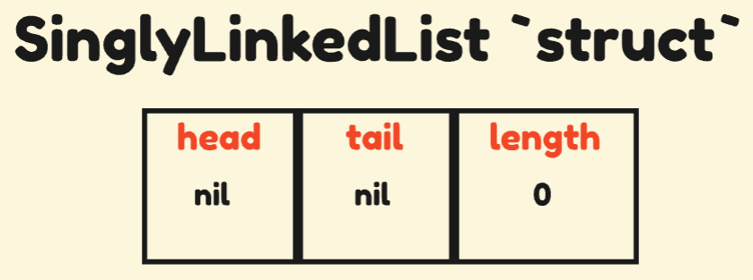

# Implementation Tutorial

> This tutorial will serve to detail the implementation of one of the data structures (in this case, the **Singly Linked List**), which is the foundation for many other data structures!

The main reason for this implementation (besides revisiting the same learnings I had in **Clang**) is to show how _pointer_ manipulation works!
So, don't forget to review [**this topic**](../README.md).

## Previous Details

Before starting to implement (I promise it will be the last topic before implementation), I will talk about two concepts that are present in every implementation: the `error` type (in addition to the `errors` package) and _generic_ types.

### The `error` Type

In **Go**, there are no exceptions and no `try-catch` statement blocks. So, how do you deal with _error handling_?
In a simpler and more modular way: just one `if` statement and one "instance" of `error`.

`error` type is defined as an _interface_:

```go
type error interface {
    Error() string
}
```

> This an important detail: it allows you to create custom errors!

This is the most common statement block in **Go**:

```go
err := doSomeThing() // returns an error
if err != nil {
    // handling the error
}
```

Or using an `if-init` statement block:

```go
if err := doSomeThing(); err != nil {
    // handling the error
}
```

As `error` is a _reference type_, its **zero value** ¹ (or _default_ value) is `nil`.

¹ **_Zero value_** is the value that a variable receives when declared, but not initialized.
**Primitive types** receive **0** (if they are numeric), **false** (if they are boolean), or an **empty string**.
Whereas **reference types** (errors, functions, pointers, and interfaces) receive `nil`.
As a result, structures that hold primitive or reference fields will receive their respective zero velues.

I understood what the `error` type is, but how can I make it more concise when handling it?
Similar to other programming languages that support the `Exception` type (like in **C#**), the `error` type can be specified with a _message_. That would be precisely the implementation of the `error` interface.

There are two ways to define custom error messages: with the `Errorf()` function (from the `fmt` package) or with the `New()` function (from the [`errors`](https://pkg.go.dev/errors) ² package) that work similarly.

² The `errors` package is much broader, focusing on error handling.

```go
package main

import (
    "errors"
    "fmt"
)

// with `fmt` pkg
func AnError() error {
    return fmt.Errorf("Generate an error")
}

// or with `errors` pkg
func OtherError() error {
    return errors.New("Generate another error")
}

func main() {
    err1, err2 := AnError(), OtherError()
    fmt.Println(err1, err2)
    // it will show `Generate an error Generate another error`
}
```

> It will be a very useful feature when we implement methods that need to manipulate our list, but it isn't a valid operation. Keep that in mind!

### Generic types

Finally, I want to talk about _generic types_ in **Golang**!
An interesting detail is that this feature was added in version _1.18_ (with some reluctance from part of the community).

Before _generics_, a "strategy" to support various types in a function/method **was to use empty interfaces**. Agreeing with some **Go** developers, here in Brazil, this would be called POG _Programação Orientada a Gambiarra_ (trying to solve something in a unrecommended way, with potential **_side effects_**).

Even though the use of the _empty interface_ feature has its place (like in the `println()` function or in `fmt.Println()` and similar -- but now with the `any` **constraint**) it's not advisable to use it in more complex cases.

Note the following case:

```go
func Sum(i ...interface{}) (interface{}, error) {
    sum := i[0]
    for j := 1; j < len(i); j++ {
        switch sum.(type) { // type assertion
        case int:
            if v, ok := i[j].(int); ok {
                sum = sum.(int) + v
            } else {
                return nil, fmt.Errorf("Error: incompatible types")
            }
        case float64:
            if v, ok := i[j].(float64); ok {
                sum = sum.(float64) + v
            } else {
                return nil, fmt.Errorf("Error: incompatible types")
            }
        case float32:
            if v, ok := i[j].(float32); ok {
                sum = sum.(float32) + v
            } else {
                return nil, fmt.Errorf("Error: incompatible types")
            }
        default:
            return nil, fmt.Errorf("Error: unsupported type")
        }
    }
    return sum, nil
}
```

> It's a generic sum function with variable parameters (**_variadic function_**). You can see that the code becomes very rigid and it will be necessary to modify it to add new types, _meaning it's open for implementation_.

But with generic types, we get a cleaner result.

```go
func Sum[T int | float64 | float32](t ...T) T {
    var sum T

    for _, v := range t {
        sum += v
    }
    return sum
}
```

> We'll use this feature a lot in ourt list nodes, since it can handle **strings**, **integers**, and **floats**, for example.

## Implementation (for real)

Now, let's get to work!
So, let's start with the definition of a _linked list_.

> A linked list is a linear and dynamic data structure that, unlike _array_, does not require each **memory cell** (the space in memory dedicated to storing a **node** -- the data in question) to be contiguous\*.
> Therefore, insertion and deletion operations are done at runtime with `O(n)` complexity in the worst case.

\* For example, in **Go**, the data structure called an _array_ in defined statically as `[n]type`, where the parameter `n` is an integer that specifies how many **cells** (of certain data type) should be stored in memory at compile time.

```go
package main

import "fmt"

func main() {
    array := [5]int{1, 2, 3} // it isn't necessary to assign all fields, they will receive a zero value
    fmt.Println(array, len(array)) // it will show `[1 2 3 0 0] 5`
    array[9] = 7; // ❌ this statement will generate a compile-time error because index `9`doesn't exist
}
```

```bash
# command-line-arguments
...: invalid argument: index 5 out of bounds [0:5]
```

Linked lists can be seen as _slices_ (the dynamic data structure in **Go**) from a memory behavior perspective: memory is allocated dynamically.

```go
package main

import "fmt"

func main() {
    slice := []int{2, 3, 5} // the size of the structure is not defined
    fmt.Println(slice, len(slice)) // it will show `[2 3 5] 3`

    slice = append(slice, 7) // a new value is added to the slice
    fmt.Println(slice, len(slice)) // now, it will show `[2 3 5 7] 4`
}
```

The main advantage of using linked lists (or other dynamic structures) is scalability:
if an application grows (in terms of users consuming or requesting it, for example),
**a list won't be limited by allocated memory -- as long as the machine provides enough memory**.

### Inception

> In this topic, I will try to follow the same pattern that I added in my implementation.

The first step of our project is to define the _smallest unit_ of the linked list: **the node**.

For abstraction reasons, a **node** can be seen as _a structure containing **the definition of data to be stored** and **a pointer
of its own type**_. If we imagine enough, we can already see the data structure being built from these _pointers_!

Viewing a node, it would be something like this:

<p align="center">

</p>

Or from the declaration of the structure:

> Assuming you have created your project, create a file `node.go` in `./linked-list/node/` and add the code below:

```go
package node

type Node[T int | float64 | string] struct {
    Data T
    Next *Node[T]
}
```

An alternative to reduce the number of types we define as generic is to declare an interface for this purpose.

> Create a new file `types.go` in the same package `node`:

```go
package node

type Number interface {
    int | float32 | float64
}
```

As a result, the `Node` structure would look like this:

```go
// ...

type Node[T Number | string] struct {
    // ...
}
```

Now we can create the concept of a **singly linked list**:

> In another package (`linked-list/collections`), a file called `singly_linked_list.go` will be created:

```go
package collections

import "linked-list/node"

type SinglyLinkedList[T node.Number | string] struct {
    head   *node.Node[T]
    length int
}
```

Or through a visual representation:

<p align="center">

</p>

> In the modeling of this concept, I considered that the list allows only one pointers (just for the beginning),
> the _head_ of the list. But it is completely feasible to implement it with two nodes, the _head_ and the _tail_.

### Construction

Before anything else, let's take a step thinking about the **_customer code_**, without needing to manually
inialize a _list pointer_ every time you want a new list. Let's create a constructor (remember that?)!

```go
package collections

// ...

func NewSinglyLinkedList[T node.Number | string]() *SinglyLinkedList[T] {
    return &SinglyLinkedList[T]{
        head: nil,
        length: 0,
    }
}
```

And since the list has a constructor, the node also needs one.

```go
package node

// ...

func NewNode[T Number | string](data T) *Node[T] {
    return &Node[T]{
        Data: data,
        Next: nil,
    }
}
```

> Unlike the list constructor, the node constructor has parameters . It initializes the data it stores.

Now we can start implementing the list manipulation methods (`add`, `remove` and `print`)!

### `Add` Method

Let's create our first method in the `collections` package: the `Add` method!

> One important point: in my implementation, I made some distinctions in the methods (for example, in the `Add` and `InsertAt`
> methods which have some differences), but here **there will be a single insertion method and a single deletion method**.

The linked list allows for three cases of inserting an element: at the _head_, in the _middle_, or at the _tail_ (which can treated the same way as the _middle_).
Inserting at the head is **_constant_** (that is, in terms of **_time complexity_**, it is **O(1)** -- if you're confused, look up
[**Computational Complexity**](https://en.wikipedia.org/wiki/Computational_complexity) and
[**Big-O Notation**](https://en.wikipedia.org/wiki/Big_O_notation)), while insertion in the middle and at the tail the is **_linear_**
(or, more precisely, **O(n)**).

> Besides the code, I will also include visual representations. Since the pointers will store the addresses of structures,
> I will use an _arrow_ to represent that.
>
> Instead:
>
> <p align="center">
> 
> </p>
> I'll use this:
>
> <p align="center">
> 
> </p>

So, let's start with the _signature of our method_: what is needed? **I know we need to pass data to be stored**
(which will consequently create a node within this method). But I can't just add a node after another
(otherwise, it would be a **_queue_**), **I need to specify the desired position**.

We identified two _requirements_:

1. add a node to the list with the data passed as a parameter;
2. Add that node at the specified position.

Great, we have the following declaration from our method so far:

```go
package collections

// ...

func (list *SinglyLinkedList[T]) Add(index int, data T) <?> {
    // ...
}
```

> But does the method return anything? And if the entered position is invalid?
> We can already come up with a solution.

```go
package collections

import (
    "linked-list/node"
    "errors"
)
// ...

func (list *SinglyLinkedList[T]) isValidIndexForAdd(index int) bool {
    return index >= 0 && index <= list.length
}

func (list *SinglyLinkedList[T]) Add(index int, data T) error {
    if !list.isValidIndexForAdd(index) {
        return errors.New("error: out of range index")
    }

    // ...

    return nil
}
```

Let's start with the base case: _inserting at the head of the list_.

The initial insertion is **constant**, but it happens in two cases:

1. when the _length_ of the list is **0**; or
2. when the _provided index_ is **0**.

For the first case:

<p align="center">

</p>

<p align="center">

</p>

Or for the second case:

<p align="center">

</p>

<p align="center">

</p>

But the insertion in the middle (`i = 1, 2, ..., n-1`) or at the end (`i = n`) is **linear**, so they happen in
a similar way -- therefore, the same steps are followed:

1. the first step is **to reach the element before position _k_** (that is, at **_k-1_**) with a _**hook pointer**_
   of type `Node`;
2. already with the pointer of **the node to be inserted, point it to the _k-th_ node**;
3. finally, **the element at _k-1_ now points from _k_ to the node to be inserted**.

<p align="center">

</p>

<p align="center">

</p>

At the end, it's the same implementation, but the visual proof is different:

<p align="center">

</p>

<p align="center">

</p>

Here is the sample code:

```go
package collections

// ...

func (list *SinglyLinkedList[T]) Add(index int, data T) error {
    if !list.isValidIndexForAdd(index) {
        return errors.New("error: out of range index")
    }
    newNode := NewNode[T](data)

    if list.length == 0 {
        list.head = newNode
    } else if index == 0 {
        newNode.Next = list.head
        list.head = newNode
    } else {
         hook := list.searchPreviousNode(index)

         newNode.Next = hook.Next
         hook.Next = newNode
    }

    list.length++
    return nil
}

// ...

func (list *SinglyLinkedList[T]) searchPreviousNode(index int) *node.Node[T] {
    searcher := list.head

    for (index - 1 > 0) {
        searcher = searcher.Next
        index--
    }
    return searcher
}
```

### `Remove` Method

Create the method `Remove` _as an implementation exercise with visual proofs_, given the implementation
of the method `Add`.

Here is the sample code for comparison purposes:

```go
package collections

func (list *SinglyLinkedList[T]) isValidIndexForRemove(index int) bool {
    return index >= 0 && index < list.length
}

func (list *SinglyLinkedList[T]) Remove(index int) (T, error) {
    var data T

    if list.length == 0 {
        return data, errors.New("error: list is empty")
    }

    if !list.isValidIndexForRemove(index) {
        return data, errors.New("error: list is empty")
    }
    hook := list.searchPreviousNode(index)

    if index == 0 {
        list.head = hook.Next
    } else {
        hookAtPreviousIndex := hook
        hook = hook.Next
        hookAtPreviousIndex.Next = hook.Next
    }
    data = hook.Data
    hook.Next = nil

    list.length--
    return data, nil
}
```

### `Print` Method

Unlike all the other methods, this one is quite simple: just go through the list (passing through each node) and print it data.

The complete implementation is intuitive:

```go
package collections

import (
    "linked-list/node"
    "errors"
    "fmt"
)

// ...

func (list *SinglyLinkedList[T]) Print() {
    hook := list.head

    for (hook != nil) {
        fmt.Printf("%v, ", hook.Data)
        hook = hook.Next
    }
    fmt.Printf("Length: %v\n", list.length)
}
```

**We finally reached the end of this great journey!**

I hope you've learned as much as I have during this process. Now it's up to you to explore this repository and make your own implementationns (and maybe even add a testing layer, just like a suggestion).
